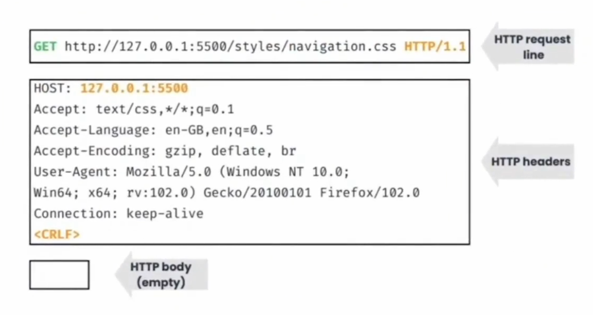
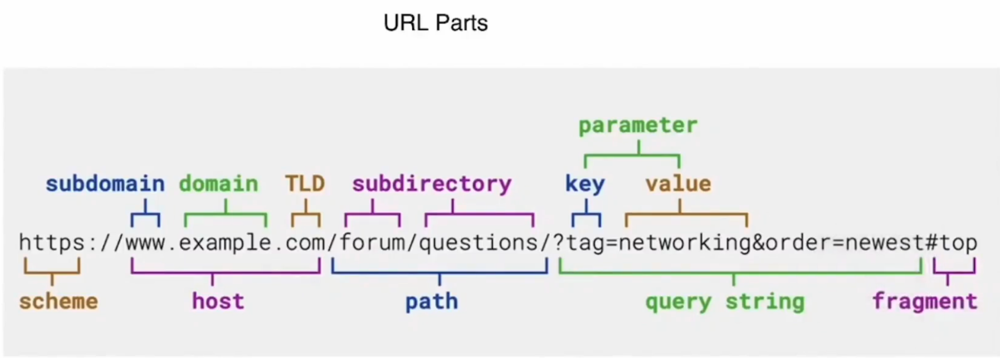

# Basic Networking 🌐

Before delving deep into system design, it's essential to have an idea of how the client-server model works.

**NOTE:** The goal is to understand how complex systems communicate with each other and explore communication protocols such as REST, gRPC, GraphQL, and determine when to use each.

If you're not familiar with OSI and how the internet works, don't worry! 😈

You don't need to know everything.

---

### Networking: Interconnection of networking devices to communicate using some system.

### Internet: A network of networks.

- To move from one host to another, packet switching is used, and it hops on network devices like routers, switches, repeaters, etc.

---

## Working Of Internet 🤔

Ever wondered what happens when you visit google.com? At a high level, you visit a site and it displays a fully functional page.

However, it's more than just a single request. When you visit dynamic sites like flipkart.com, many things happen in the background that can be observed in the network tab of the developer console of any browser.

### DNS Overhead

When you visit any site like flipkart.com, your query first goes to the local DNS server. If found, it returns the IP; otherwise, it gets the IP from the remote DNS server. This process of obtaining the IP from the remote DNS server is called DNS Overhead.

- Our local machine can retrieve DNS from multiple locations in order:
  - Browser (Cache, service worker)
  - Operating System (Name Service Cache Daemon (nscd))
    You can set and change DNS resolver configuration in Linux from /etc/resolv.conf.
  - Router DNS Cache
  - ISP DNS Cache Servers

To get the Domain, there is a hierarchy to get the domain mapping faster. Our request filters the servers to search first by Top-level Domains (TLDs) like .com, .edu, .org, .dev, etc. Then we have second-level domains and third-level domains to get the IP, as shown in the image:

## IP Address

An IP address is a way to identify a network and host, just like PIN code or ZIP codes. It is a 32-bit binary number representing the logical location of a host/server.

**NOTE:** Generally, in a microservice architecture, any call strikes to the IPs of the API Server (also called as GATEWAY), which performs internal routing and returns the response.

Then automatically, the browser performs a GET request to that IP address, and you get HTML as a response:

HTML and CSS are responsible for the structure and design of the page. Interactivity and actions are performed with the help of JavaScript.

**NOTE:** Browsers support 3-8 parallel requests at a time. Requests more than that go into a queue to fetch afterward.

When you visit sites like www.priyankrai.in, you are requesting the page present at the root '/' of the application. But if you visit something like www.linkedin.com/in/urstrulypriyank, in the above URL, you are defining the path to exactly what you want. /in/urstrulyrpiyank will return my LinkedIn profile instead of the root page of the site.

**Have you noticed that for the root, you don't need to mention the root path explicitly in the browser, like www.google.com/?**

## Bundle Size of Web Application

When you visit a site like priyankrai.in, it will respond with HTML, CSS, and JavaScript.

**Best practice is to reduce the bundle size as much as possible because there is a lot of processing and parsing, which increases the initial loading time, resulting in slow sites.**

There are steps which the browser performs before the site becomes fully interactive and responsive:

1. Loading CSS and JS: When a web page is requested, the browser starts by fetching the HTML file. As it parses through the HTML, it encounters links to external CSS and JavaScript chunks. These files are then fetched asynchronously.
2. Processing CSS and JS: Once the CSS and JS files are downloaded, the browser begins to parse and execute them. This includes interpreting JavaScript code and applying styles defined in CSS to the HTML elements in the document.
3. Forming the DOM (Document Object Model): As the HTML is parsed, the browser constructs the DOM, which is a tree-like representation of the structure of the HTML document. Each HTML element becomes a node in the DOM tree.
4. Forming the CSSOM (CSS Object Model): Similarly, as the CSS is parsed, the browser constructs the CSSOM, which represents the styles defined in the CSS files. This includes information about selectors, properties, and their values.
5. Rendering the DOM and CSSOM: The browser combines the DOM and CSSOM to create the render tree. This tree represents all the visible elements on the page and their styles. The browser then calculates the layout of each element based on this render tree.

**CSS is render-blocking until the CSS is not present; we won't see any paint. This means a CSS-heavy site might have a high FCP time.**

**JS chunk is parser-blocking, meaning until the whole JS chunk is downloaded and parsed, the tree won't be formed. (which will result in a white page)**

After parsing DOM for HTML element document hierarchy and CSSDOM for the element design will be formed and after that both will be merged to form the render Tree.

---

---

## Communication Protocols

<pre>
HTTP: HTTP stand's for hyper text transfer protocol, It is a foundational communication protocol of world wide web. It is stateless protocol, used for data transfer, downloading files from websites.
- Many Mordern web application and API's uses HTTP methods such as GET, PUT, POST, DELETE

HTTPS: It is extenstion of HTTP also called Secure HTTP that uses ssl certificate and TLS for trafic encryption.

Web Sockets: extension of HTTP, used for realtime chat application, it becomes full duplex after first connection.
-> Hard to scale

SMTP -> simple mail transfer protocol. mail go through smtp server for mailing address location

FTP: file transfer prtocol, used to transfer files. 
</pre>

### Transport Layer Protocol

TCP: It is a protocol that works in transport layer, it gurantees the delivery of the packets

UDP: It is also works on transport layer. It is less reliable, best suited for where minor data loss doesnot make any difference example: video calling, VoIP,

- It is faster
- Header compressing is used (also know ad HTTP/3)

## REST API

| </t> <b> Topics </b>                                          |
| ------------------------------------------------------------- |
| What is REST API ?                                            |
| Benifits & why REST API                                       |
| Building Blocks (URL, METHODS, HEADERS, REQ,RES, STATUS CODE) |

### Definition of REST

It stands for representational state transfer protocol, In earlier times, there was only a monolithic architecture where the frontend and backend resides on the same machine, which limits the scalability.

    In a 1-tier architecture, where the client and server are on the same machine, only horizontal scaling is possible, which has scalability limits.

## What Problem Does REST Solve ?

It provide us the ability to seperate frontend and backend whcih gives birth to (2-tier architecture)
i.e client and server are on different machine.

2/3 tier application are vertical as well as horizontal scalable with horizontal scaling have physical limit but vertical scaling doesn't.

**REST provides a standardized format for data transfer and communication between the client and server.**

**REST API =Representational state transfer Application programming interface,
makes 2 different programming language talk to each other.**

## Benifits of REST API

- Ease of use (from client you can use fetch or axios from server)
- stateless (every request treated as new request which provide freedom to query from any server from the cluster of servers) which ulitmaltely provide scalibilty.
- Flexibility: independent of data exchange format like: JSON, xml ,yaml ...etc.
- Uniform interface: provide standard way to do the things like uri,params methods etc..
- Beacuase of stateless beahaviour caching is possible
- Helps in sepration of concern as the services can be independently hosted and used like (implementation of SSO single signon services).
- Language Agnostic: provide interoperability b/w the technologies.
- Provides Security over HTTPS.

## Building Blocks

Requests
There are standard way to send requests in REST.
Request have 3 parts as shown in image below

1. HTTP Request Line
2. HTTP Header
3. HTTP Body

Respnose :

---

### URL

A URL (Uniform Resource Locator) serves as an address to locate resources on the web. Understanding its components is crucial for navigating the vast internet landscape.

Components:

    Scheme: This indicates the protocol used, such as HTTP or HTTPS, defining how resources are accessed.

    Host: The host section contains the domain name, subdomain (if any), and top-level domain (TLD). It identifies the server hosting the website.

    Path: The path represents the specific location of the resource on the server. It's a combination of directories and subdirectories.

    Query String: This section contains key-value pairs separated by "&". It provides additional parameters for the resource, often used in dynamic web pages.

    Fragment: This specifies a specific portion of the webpage, typically identified by an anchor or bookmark within the document.

Example:

Consider the URL "https://www.example.com/products/shoes?color=blue#reviews".

    Scheme: HTTPS
    Host: www.example.com
    Path: /products/shoes
    Query String: color=blue
    Fragment: reviews

Understanding URL components enhances web navigation and aids in effective resource retrieval.

---

### API Designing Practices

Supose You need to create a TODO application the best practice is to be description like : https://localhost:2000/api/todos or https://localhost:2000/api/users

- It is genrally best practices to have a common /api route for apis

Featrues:

- Create Todo
- Read Todo
- Update Todo
- Delete Todo

**In order to perform operation you can use METHODS**
|Features| Methods|
|---| --- |
|create Todo|POST|
|Read Todo|GET|
|Edit Todo|PUT/PATCH|
|Delete Todo|Delete|

HEAD: It is method to get the headder information.

OPTION: here you can specify cross origin request policy

CONNECT: It is used to establish the connection , repaeat request becomes faster

TRACE: The TRACE method in HTTP (Hypertext Transfer Protocol) is used primarily for diagnostic purposes. When a client sends a TRACE request to a server, the server echoes back the received request, allowing the client to see how the request is altered (if at all) by intermediate servers, proxies, or gateways.

### Headers

**Request Headers**
|Header| Use | Example |
|---|---|---|
|Host| Target Host / server address | host: www.example.com|
|Origin| Origin Host (from where request is originating) | host: www.flipkart.com|
|Referer| Indicate previous web page from which the link clicked | dynamic in nature|
|User-Agent| provide OS, browser and Architecuter of client to the server |ex: Mozilla/5.0 (X11; Linux x86_64; rv:109.0) Gecko/20100101 Firefox/115.0|
|Accept| Expected Response Type | <pre>Accept: <MIME_type>/<MIME_subtype>,Accept: text/html, application/xhtml+xml, application/xml;q=0.9</pre>|
|Accept-Language| prefered response content language |en-US,en-UK:0.9|
|Accept-Encoding| tells encoding algorithm | gzip,deflate,br |
|Connection| Keep TCP Connection Open | keep alive, close |
|Autorization| Send Credential | Authorization:Bearer- |
|Cookie| Previous server token can be sent | key=some_value |
|Cache-control| cache expirty time | max-age=604800, no-cache,no-store ..etc |
|if-modified-since| if data modified from mentioned time then send data | data |

**Response Headers**
|Header| Use | Example |
|---|---|---|
|Host| Target Host / server address | host: www.example.com|
|Date| give time and data of response |date: Sun, 14 Apr 2024 07:18:57 GMT|
|Server| It provide server info. |server: gws,vercel, apcahe, nginx|
|Content-Type| type of response | content-type:text/html;   charset=utf-8 |
|Content-Type| type of response | content-type:text/html;   charset=utf-8 |
|Content-Length| length of data (browser leverage during downloading ) | 256 |
|Set-cookie| informs about cookie need to store for future request | Set-cookie:user:hash_value_XXXXXX |
|Content-encoding| algo that can be used to decode  | sha,rsa |

### Response Status Codes
HTTP response status codes indicate whether a specific HTTP request has been successfully completed. Responses are grouped in five classes:
- Informational responses (100 – 199)
- Successful responses (200 – 299)
- Redirection messages (300 – 399)
- Client error responses (400 – 499)
- Server error responses (500 – 599)

|Status Code Range| Description|
|---|---|
|1XX Informational responses (100 – 199) | These are provisional responses indicating that the client's request was received, continuing the process. For example, 101 indicates switching protocols, typically used in WebSocket connections.|
|2XX 	Successful responses (200 – 299) | These codes indicate that the client's request was successfully received, understood, and accepted. Common codes include: 200 OK (general success), 201 Created (for successful POST requests, indicating that a new resource has been created), 202 Accepted (indicating that the request has been accepted for processing, but the processing may not be complete), 204 No Content (indicating that the server has fulfilled the request but does not need to return an entity-body), and 206 Partial Content (used for partial GET requests, indicating that the response only contains a portion of the requested resource).|
|3XX	Redirection (300 – 399) | These codes indicate that further action needs to be taken by the client to fulfill the request. Common codes include: 301 Moved Permanently (indicating that the requested resource has been permanently moved to a new location), 302 Found (indicating that the requested resource has been temporarily moved to a different location), 307 Temporary Redirect (similar to 302, but it retains the request method upon redirection), and 308 Permanent Redirect (similar to 301, but it retains the request method upon redirection).|
|4XX 	Client Error (400 – 499)| These codes indicate that there was an error on the client's part, such as malformed requests or unauthorized access. Common codes include: 400 Bad Request (indicating that the server cannot process the request due to a client error), 401 Unauthorized (indicating that the request requires user authentication), 403 Forbidden (indicating that the server understood the request, but refuses to authorize it), 404 Not Found (indicating that the requested resource could not be found on the server), and 405 Method Not Allowed (indicating that the method specified in the request is not allowed for the resource identified by the request URI).|
|5XX	Server Error (500 – 599)| These codes indicate that there was an error on the server's part while trying to fulfill the request. Common codes include: 500 Internal Server Error (indicating that the server encountered an unexpected condition that prevented it from fulfilling the request), 501 Not Implemented (indicating that the server does not support the functionality required to fulfill the request), 502 Bad Gateway (indicating that the server, while acting as a gateway or proxy, received an invalid response from an inbound server), 503 Service Unavailable (indicating that the server is currently unable to handle the request due to temporary overloading or maintenance of the server), and 504 Gateway Timeout (indicating that the server, while acting as a gateway or proxy, did not receive a timely response from an upstream server it needed to access in order to complete the request).|

---

## Creating First Rest API

We will use ExpressJS with node for creating first api
