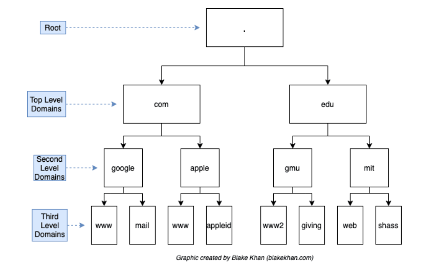
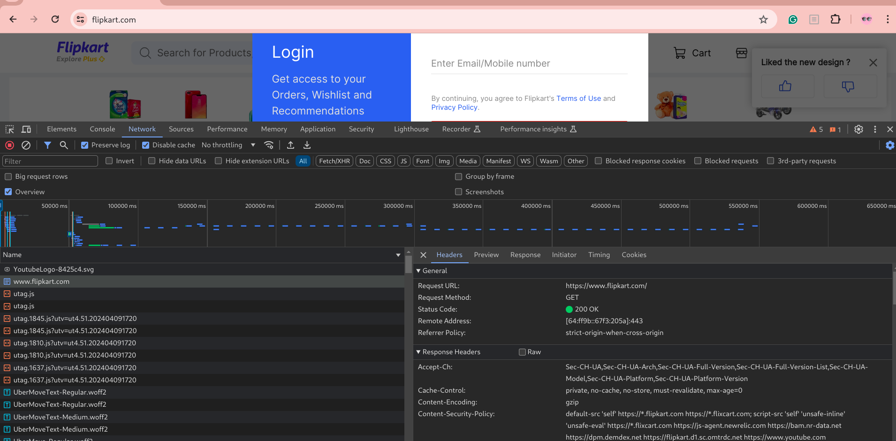
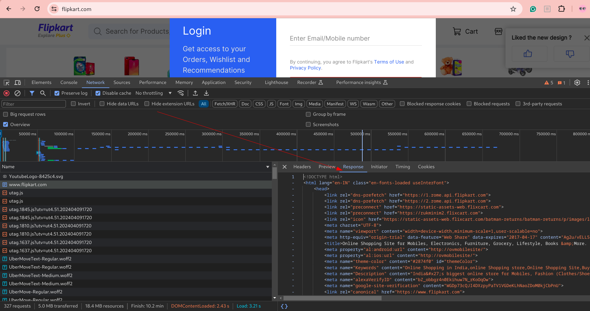
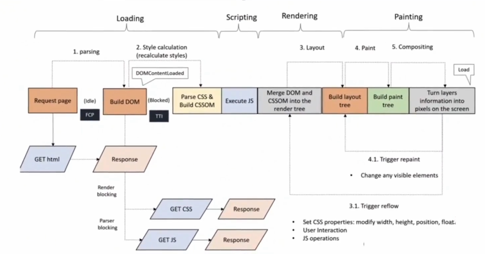

# Basic Networking 🌐

Before delving deep into system design, it's essential to have an idea of how the client-server model works.

**NOTE:** The goal is to understand how complex systems communicate with each other and explore communication protocols such as REST, gRPC, GraphQL, and determine when to use each.

If you're not familiar with OSI and how the internet works, don't worry! 😈

You don't need to know everything.

---

## Networking: Interconnection of networking devices to communicate using some system.

## Internet: A network of networks.
- To move from one host to another, packet switching is used, and it hops on network devices like routers, switches, repeaters, etc.

---

# Working Of Internet 🤔

Ever wondered what happens when you visit google.com? At a high level, you visit a site and it displays a fully functional page.

However, it's more than just a single request. When you visit dynamic sites like flipkart.com, many things happen in the background that can be observed in the network tab of the developer console of any browser.

## DNS Overhead
When you visit any site like flipkart.com, your query first goes to the local DNS server. If found, it returns the IP; otherwise, it gets the IP from the remote DNS server. This process of obtaining the IP from the remote DNS server is called DNS Overhead.

- Our local machine can retrieve DNS from multiple locations in order:
  - Browser (Cache, service worker)
  - Operating System (Name Service Cache Daemon (nscd))
    You can set and change DNS resolver configuration in Linux from /etc/resolv.conf.
  - Router DNS Cache
  - ISP DNS Cache Servers

To get the Domain, there is a hierarchy to get the domain mapping faster. Our request filters the servers to search first by Top-level Domains (TLDs) like .com, .edu, .org, .dev, etc. Then we have second-level domains and third-level domains to get the IP, as shown in the image:

## IP Address
An IP address is a way to identify a network and host, just like PIN code or ZIP codes. It is a 32-bit binary number representing the logical location of a host/server.

**NOTE:** Generally, in a microservice architecture, any call strikes to the IPs of the API Server (also called as GATEWAY), which performs internal routing and returns the response.

Then automatically, the browser performs a GET request to that IP address, and you get HTML as a response:

HTML and CSS are responsible for the structure and design of the page. Interactivity and actions are performed with the help of JavaScript.

**NOTE:** Browsers support 3-8 parallel requests at a time. Requests more than that go into a queue to fetch afterward.

When you visit sites like www.priyankrai.in, you are requesting the page present at the root '/' of the application. But if you visit something like www.linkedin.com/in/urstrulypriyank, in the above URL, you are defining the path to exactly what you want. /in/urstrulyrpiyank will return my LinkedIn profile instead of the root page of the site.

**Have you noticed that for the root, you don't need to mention the root path explicitly in the browser, like www.google.com/?**

## Bundle Size of Web Application

When you visit a site like priyankrai.in, it will respond with HTML, CSS, and JavaScript.

**Best practice is to reduce the bundle size as much as possible because there is a lot of processing and parsing, which increases the initial loading time, resulting in slow sites.**

There are steps which the browser performs before the site becomes fully interactive and responsive:

1. Loading CSS and JS: When a web page is requested, the browser starts by fetching the HTML file. As it parses through the HTML, it encounters links to external CSS and JavaScript chunks. These files are then fetched asynchronously.
2. Processing CSS and JS: Once the CSS and JS files are downloaded, the browser begins to parse and execute them. This includes interpreting JavaScript code and applying styles defined in CSS to the HTML elements in the document.
3. Forming the DOM (Document Object Model): As the HTML is parsed, the browser constructs the DOM, which is a tree-like representation of the structure of the HTML document. Each HTML element becomes a node in the DOM tree.
4. Forming the CSSOM (CSS Object Model): Similarly, as the CSS is parsed, the browser constructs the CSSOM, which represents the styles defined in the CSS files. This includes information about selectors, properties, and their values.
5. Rendering the DOM and CSSOM: The browser combines the DOM and CSSOM to create the render tree. This tree represents all the visible elements on the page and their styles. The browser then calculates the layout of each element based on this render tree.

**CSS is render-blocking until the CSS is not present; we won't see any paint. This means a CSS-heavy site might have a high FCP time.**

**JS chunk is parser-blocking, meaning until the whole JS chunk is downloaded and parsed, the tree won't be formed. (which will result in a white page)**

After parsing DOM for HTML element document hierarchy and CSSDOM for the element design will be formed and after that both will be merged to form the render Tree.

----
----

# Communication Protocols
<pre>
HTTP: HTTP stand's for hyper text transfer protocol, It is a foundational communication protocol of world wide web. It is stateless protocol, used for data transfer, downloading files from websites.
- Many Mordern web application and API's uses HTTP methods such as GET, PUT, POST, DELETE

HTTPS: It is extenstion of HTTP also called Secure HTTP that uses ssl certificate and TLS for trafic encryption.

Web Sockets: extension of HTTP, used for realtime chat application, it becomes full duplex after first connection.
-> Hard to scale

SMTP -> simple mail transfer protocol. mail go through smtp server for mailing address location

FTP: file transfer prtocol, used to transfer files. 
</pre>
## Transport Layer Protocol

TCP: It is a protocol that works in transport layer, it gurantees the delivery of the packets 

UDP: It is also works on transport layer. It is less reliable, best suited for where minor data loss doesnot make any difference example: video calling, VoIP, 
  - It is faster
  - Header compressing is used (also know ad HTTP/3)

---
---

# REST 
