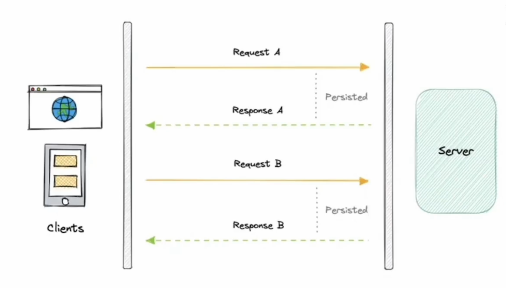

# Communication

In this tutorial we are going to learn about various techniques to send data from frontend to server and vice-versa.
In the application development the nature of the data is the main deciding factor for the choice of communication strategy

Exchange of data is called communication.

They way you exchange the is the strategy which varies on the specific requirement like - Is the data that you need should be in real-time like(VoIP, video calling) - Or the stale data is also fine.(Do You Remeber circbuzz )

## Why should you think about communication technique b/w client and server.

Short Answer is User Experience.

Think about the experience of any I'M apps where you got delay of about 5000ms for every text you send and received ?

    - You can't bear delay in emergency alert systems like SOS etc...

What if your trading chart lags behing by 1000ms ?

In today's world in the era of smartphone push notification has became the important part of communication. How does it send ? does it broadcast ? But if broadcast how do i received personalized notification from some apps ?

Delivery applications like Zomato swiggy or Uber / Uber eats share location in realtime ? (Not really they use short polling to send location after some interval repeatedly ...)

Is YT live chat is really live (real time ) ?
No it does uses short polling with caching part of chat histroy in browser memory.

**Good Communication technique makes your application more scalable.**
`There is no one best strategy`

**Let the jargons don't make you feel overwhelmed we will cover or meanwhile basic idea by looking simple definition from google.**

## Communication Techniques

- Polling
  - Short Polling
  - Long Polling
- Web Sockets
- SSE (Server Sent Events)
- WebHooks

### Polling

In this strategy you will ask the server after set interval if there is some change in data.

#### Short Polling:

- In short polling you request the data from the server from the client after every small interval of the time and if there is no change you get empty responce.
  example short polling is used by youtube chat, circbuzz, tradingView these are the services which poll the data from server after some interval
  
- short lived connection
- Non persistent connection
- Less resource utility

```JavaScript
useEffect(() =>
    const callRefrence = setInterval(() => {
         // API_CALL
            fetchDataFromAPI();
              }, NUMBER_OF_SECONDS_TO_CALL_API);
              return () => clearInterval(callRefrence);
            }, []);
```

#### Long Polling:

- In Long Polling you request the data from the server and get the response if only there is some change in data.
- It works on single long lived connection
- connection is open untill you get new data /timeout
- Cons: Large number of connection, more the load.

---

### WEB SOCKETS

Websockets are the way to create persistent connection, It is like establishing piepeline between the client and server.

It is bi-directional, statefull protocol

It provide full-duplex communication channel.

This means that the client and server can send data to each other without having to make a separate request each time. Websockets are not as scalable as HTTP, but they are better suited for applications that require near ⌛ real-time communication.

It is used where order of data does matters eg: chatApps
