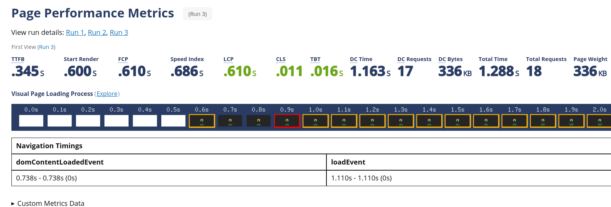
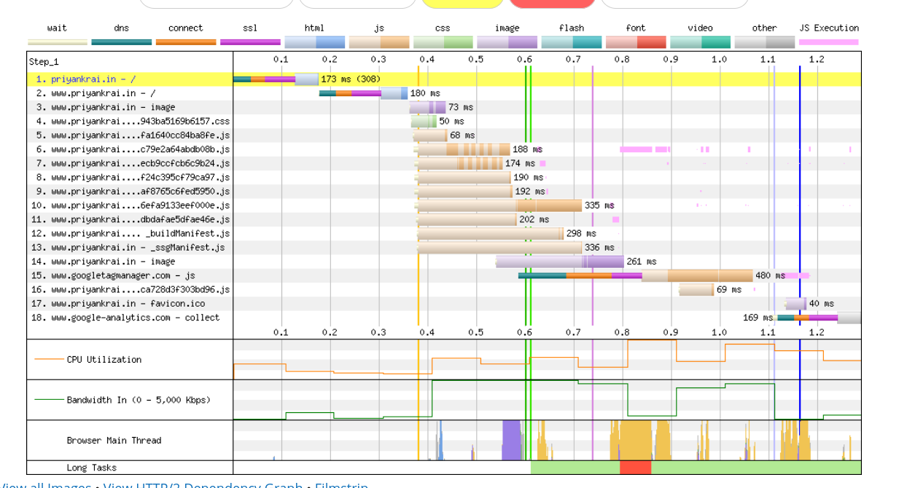

# WEB APPLICATION PERFORMANCE

We measure web performace in order to reduce the bottleneck which results in improved web page load time, and also the responsiveness of the page state.

The idea is to study the page performace to indentify the bottleneck.

** Better User Experinces retains visitors -> helps in achiving app goal.**

Until and unless you don't know where does the problem lies ,the effort to optimize go in vain or leads to success at heavy cost.

**Think of this as a doctor if you don't know where it hurts ? how would you proceed ?**

## Impact of performance in web application

    - Imporves UX
    - Helps in Revenue & Profitability (User Love engagement, can you bear sluggish experince )
    - If you don't think of perfromance -> Your app will bear high operational cost
    - SEO etc...
    - Reduction in Bounce Rate.
    - In Short Performant pages retain users.

performance and buisness success are related in one or other way.

One of the Most Important Question is How To Measure Performance ?
No Stop Watch won't help much.

There are **Performance metrics** to measure and compare performace

Do you know ?
redBus improved one perfomace metric (INP) and their sales increased by 7%

OR
BBC found out that they lost 10% of users for every additional second their site took to load

## Perormace Metrics

Earlier we talked about performance, But there is no single unique straight forward scale to measure performance, We tend to measure page performance relatively.

- A site might be faster for one user with bleeding edge machine + fast n/w but slow for another user on a slow 3g having low-end device.
- Two site finishes loading page at same time but one seems to load the content faster if it loads progressively
- In some case site becomes visible early but takes noticeable extra time to become responsive to the user resulting in bad experince even site seems to load faster.

Performance metrics like FCP, FID, CLS, LCP help up to take better improvement decision by letting developer know the where to improve

There are various types of metrics to measure performance, There are 2 most used metric type which is widely used:

- User Centric Metrics (deals with UX).
- Browser Centric Metrics.

  Neither of two above metric is better or worse. we generally use combination of both to determine the bottleneck.

1.  User Centric Metrics:
    The idea is to simulate Real User Monitoring(RUM) to compare performance
    Here the metric represent the real behaviour experienced by the users.
    The performance of a site can vary drastically based on a user's device capabilities and network conditions.
    eg:
    First Contentful Paint (FCP): The time it takes for the first piece of content (text, image, etc.) to render on the screen.
    Largest Contentful Paint (LCP): The time it takes for the largest content element to render within the viewport.
    First Input Delay (FID): The time it takes from when a user interacts with a page (like clicking a button) to when the browser responds.
    Cumulative Layout Shift (CLS): Measures visual stability by calculating how much elements on a page shift during loading.
    Time to Interactive (TTI): The time it takes for a page to become fully interactive, where users can interact without delays.
    Total Blocking Time (TBT): Measures the total time that the main thread is blocked during the page loading, affecting interactivity.
    Page Load Time: The total time it takes for a page to fully load in the user's browser.

2.  Browser Centeric Metric
    The idea is to simulate the users with the help of numeros proxy and measure the performance and get the average of it.
    Browser-centric metrics are focused on measuring the performance of a website from a technical perspective, primarily looking at how the browser and related systems handle tasks. These metrics help developers understand the technical aspects of a site's performance and can guide optimizations at a more granular level.

    DOM Content Loaded (DCL): The time it takes for the DOM (Document Object Model) to be fully loaded and parsed.

    Load Event: The time when the page and its resources (like images and scripts) are fully loaded.

    JavaScript Execution Time: The time it takes for the browser to execute JavaScript code.
    Resource Load Times: The time it takes to load specific resources, like images, scripts, and stylesheets.

    Network Latency: The time it takes for data to travel between the client and server.

Demo 1:

from the above data we can calculate what are the fields that needs to be improved like:

- minor layout shift can be improved

Demo 2:

From the waterfall view we can conclude that images can be prefetched or SVG file format can be taken into consideration for better result.

There are tools that help us to perfrom the analysis on the site and get result in terms of metics and perfromance suggestion:

Tools Inside Developer Mode of Browser: - Lighthouse - Network Tab - Perfromance Tab
External And More Powerfull Tools:

- pagespeed.web.dev
- requestmetrics.com
- clarity.microsoft.com
- google analytics
- new relic

My Favourite and powerfull

- webpagetest.org

Tip: whenever you test in browser, test the site in incognito mode with ducked out developer console.

**Remember:** Balancing user-centric and browser-centric metrics is key to comprehensively assessing performance.

#web #performance #frontend #metrics
